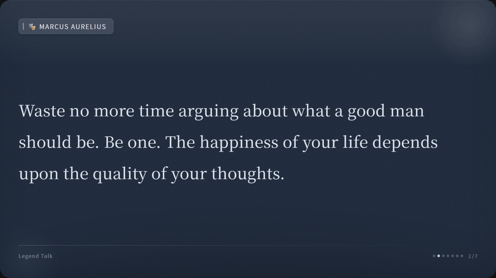

# json2card

> 365 Open Source Plan #003 · Turn any JSON into clean, on-brand cards — chat exports auto-detected. Web UI, CLI, or REST API.

[中文文档](README.zh.md)

Stop screenshotting messy Slack, ChatGPT, or Claude threads. Paste the raw export and json2card auto-detects the format and lays it out as shareable cards — no schema setup, no cleaning it up in Figma afterward. Match your brand, then drop the PNGs straight into a blog post, Notion, or a 16:9 slide deck.


## Features

- **Auto-detects any export** — ChatGPT, Claude, Telegram, Discord, Slack, or your own JSON. Multi-sample validation gets the structure right on the first try; for an odd shape, point at the fields with a one-line mapping.
- **Make it yours before export** — Brand theme (one background + text color to match your blog or slide deck), upload your own font, 6 style presets in a visual gallery, 16-color palette, 5 sizes, watermark — no editing the PNG afterward.
- **Handles messy input gracefully** — Long messages auto-paginate, nested / non-string content is coerced to text, fenced code blocks stay monospace, and markdown is stripped to clean prose. It degrades, it doesn't blow up the layout.
- **Three ways to use** — Web UI for visual editing, CLI for batch jobs (no more one-off scripts), REST API for integration.
- **Auto-fit typography** — Short quotes scale up to fill the frame; dense and paginated text keeps your chosen size.
- **Fast & portable** — CORS-enabled API, file-based fonts + page reuse (~100ms per card on a warm server), one-command Docker deploy.

## Get Started

**Docker** (recommended):
```bash
docker run -d -p 3000:3000 json2card
```

**Docker Compose**:
```bash
docker compose up -d
```

**From source**:
```bash
npm install && npm run setup-fonts && npm start
# Open http://localhost:3000
```

## Supported Formats

| Format | Example |
|--------|---------|
| `[["speaker","text"], ...]` | Simple dialog list |
| `{role, content}` | OpenAI / Claude API (supports `name` field) |
| `{from, text}` | Telegram export |
| `{author.name, content}` | Discord export |
| `{user, text}` | Slack export |
| `mapping.*.message...` | ChatGPT export |
| Any structure | Auto-discovered or manual field mapping |

Each message renders its **text**; non-text attachments (images, files) are skipped, code blocks are kept as monospace, and other markdown is stripped to clean prose.

Chat is the sweet spot, but under the hood it's just *records → cards*: map any array of objects — quotes, notes, FAQ items, changelog entries — onto a label + text field and each row becomes a card (see the Quote / Note / News templates).

## Customization

| Category | Options |
|----------|---------|
| **Templates** | Roundtable, Quote, Note, News — one click re-slots the layout for that use |
| **Style** | 6 presets (Classic, Gentle, Textured, Quote, Magazine, Elegant) via visual gallery + 7 tunable params |
| **Brand theme** | Solid background + text color across the whole set, with one-click presets |
| **Size** | 3:4 portrait, 1:1 square, 4:3 landscape, 9:16 story, **16:9 for slides & decks** (1920×1080) |
| **Colors** | 16 auto-assigned muted tones, per-speaker override |
| **Fonts** | Auto-detected from `fonts/`, or upload one in the browser (data-URI embed; best for Latin/subset fonts) |
| **Layout** | 4 slots (header, body, footer left/right) x any field |
| **Watermark** | Custom text, bottom-right |
| **Language** | 18 UI languages, incl. right-to-left (Arabic) |
| **Theme** | Dark / Light |

**16:9 + a brand theme = a drop-in slide** — same conversation, deck-ready at 1920×1080:



## API

Two endpoints, both accept `POST` with JSON body `{data, config}`.

| Endpoint | Output |
|----------|--------|
| `/api/generate` | ZIP with separate PNGs |
| `/api/generate-long` | Single stitched PNG |

```bash
curl -X POST http://localhost:3000/api/generate \
  -H 'Content-Type: application/json' \
  -d '{"data":{"messages":[["You","Hi"],["Bot","Hello!"]]},"config":{}}' \
  -o cards.zip
```

<details>
<summary>Node.js / Python examples</summary>

**Node.js**:
```javascript
const res = await fetch('http://localhost:3000/api/generate', {
  method: 'POST',
  headers: { 'Content-Type': 'application/json' },
  body: JSON.stringify({
    data: { messages: [['You', 'Hi'], ['Bot', 'Hello!']] },
    config: { cardSize: '1:1', watermark: 'My App' }
  })
});
fs.writeFileSync('cards.zip', Buffer.from(await res.arrayBuffer()));
```

**Python**:
```python
import requests
resp = requests.post('http://localhost:3000/api/generate', json={
    'data': {'messages': [['You', 'Hi'], ['Bot', 'Hello!']]},
    'config': {'cardSize': '1:1'}
})
open('cards.zip', 'wb').write(resp.content)
```

</details>

## CLI

```bash
npm run generate                  # test.json -> output/
node generate.mjs data.json      # custom input
node generate.mjs --size 9:16    # card size
node generate.mjs --body-font X  # custom font
```

## Config Reference

All fields optional. Defaults used when omitted.

```json
{
  "config": {
    "cardSize": "3:4",
    "watermark": "Brand",
    "coverTitle": "Legend Talk",
    "fontSize": 28,
    "cardStyle": "classic",
    "brandBg": "",
    "brandText": "",
    "styleParams": {
      "textAlign": "left",
      "borderRadius": 40,
      "gradientAngle": 135,
      "noiseOpacity": 5,
      "glowIntensity": 10,
      "lineHeight": 2.0,
      "letterSpacing": 0.5,
      "gradientReverse": false,
      "showQuoteMark": false
    },
    "slots": {
      "badge": "displayLabel",
      "body": "content",
      "footerLeft": "text:Legend Talk",
      "footerRight": "pageIndicator"
    }
  }
}
```

## Environment Variables

| Variable | Default | Description |
|----------|---------|-------------|
| `PORT` | `3000` | Server port |
| `RATE_LIMIT` | `10` | Max requests per minute per IP (`0` to disable) |

## Project Structure

```
generate.mjs        — render engine
server.mjs          — Express API + CORS
fonts.mjs           — font scanning
template.html       — card template
public/             — web UI + i18n
Dockerfile          — one-command deploy
docker-compose.yml  — compose deploy
```

```bash
npm test    # 11 tests
```

## About 365 Open Source Plan

Project #003 of the [365 Open Source Plan](https://github.com/rockbenben/365opensource).

One person + AI, 300+ open source projects in a year. [Submit your idea ->](https://my.feishu.cn/share/base/form/shrcnI6y7rrmlSjbzkYXh6sjmzb)
