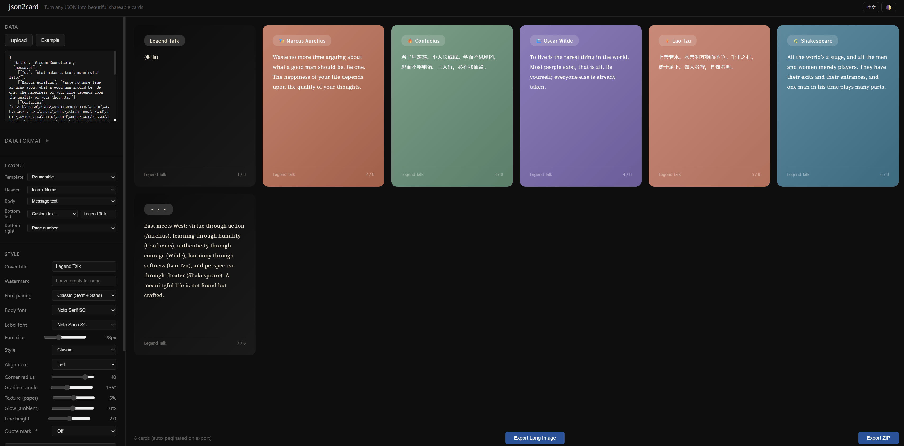
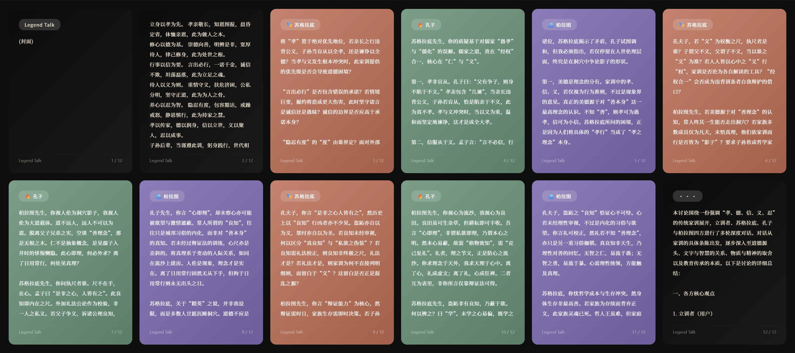

# json2card

> 365 开源计划 #003 · 将任意 JSON 转换为精美分享卡片 — 支持网页、命令行、REST API 三种方式。

[English](README.md)





## 特性

- **三种使用方式** — 网页界面可视化编辑，命令行批量处理，REST API 集成到任意系统
- **格式自动识别** — 粘贴 ChatGPT、Claude、Telegram、Discord、Slack 导出数据或任意自定义 JSON，多条消息采样验证，自动发现数据路径
- **丰富的自定义** — 6 种风格预设、5 种卡片尺寸、16 色调色板、自定义字体、4 槽位布局、水印
- **智能分页** — 长消息自动拆分为多张卡片，精确溢出检测
- **干净输出** — Markdown 标记自动移除，卡片只显示纯文字
- **跨域 API** — 已启用 CORS，部署一次即可从任何前端调用
- **高速渲染** — file:// 字体加载 + 页面复用，热服务器约 100ms/张

## 开始使用

**Docker**（推荐）:
```bash
docker run -d -p 3000:3000 json2card
```

**Docker Compose**:
```bash
docker compose up -d
```

**从源码运行**:
```bash
npm install && npm run setup-fonts && npm start
# 打开 http://localhost:3000
```

## 支持的格式

| 格式 | 说明 |
|------|------|
| `[["说话人","内容"], ...]` | 简单对话列表 |
| `{role, content}` | OpenAI / Claude API（支持 `name` 字段） |
| `{from, text}` | Telegram 导出 |
| `{author.name, content}` | Discord 导出 |
| `{user, text}` | Slack 导出 |
| `mapping.*.message...` | ChatGPT 导出 |
| 任意结构 | 自动发现或手动字段映射 |

## 自定义

| 类别 | 选项 |
|------|------|
| **风格** | 6 种预设（经典、柔和、纸质、引用、杂志、典雅）+ 7 个可调参数 |
| **尺寸** | 竖版 3:4、方形 1:1、横版 4:3、竖屏 9:16、宽屏 16:9 |
| **配色** | 16 色自动分配，可逐角色自定义 |
| **字体** | 放入 `fonts/` 目录自动识别 |
| **布局** | 4 个槽位（标题、正文、底部左/右）x 任意字段 |
| **水印** | 自定义文字，右下角 |
| **语言** | 中文 / English |
| **主题** | 暗色 / 亮色 |

## API

两个端点，均接受 `POST` 请求，JSON 请求体 `{data, config}`。

| 端点 | 输出 |
|------|------|
| `/api/generate` | ZIP 压缩包（多张 PNG） |
| `/api/generate-long` | 单张拼接长图 PNG |

```bash
curl -X POST http://localhost:3000/api/generate \
  -H 'Content-Type: application/json' \
  -d '{"data":{"messages":[["You","你好"],["Bot","你好！"]]},"config":{}}' \
  -o cards.zip
```

<details>
<summary>Node.js / Python 调用示例</summary>

**Node.js**:
```javascript
const res = await fetch('http://localhost:3000/api/generate', {
  method: 'POST',
  headers: { 'Content-Type': 'application/json' },
  body: JSON.stringify({
    data: { messages: [['You', '你好'], ['Bot', '你好！']] },
    config: { cardSize: '1:1', watermark: '我的应用' }
  })
});
fs.writeFileSync('cards.zip', Buffer.from(await res.arrayBuffer()));
```

**Python**:
```python
import requests
resp = requests.post('http://localhost:3000/api/generate', json={
    'data': {'messages': [['You', '你好'], ['Bot', '你好！']]},
    'config': {'cardSize': '1:1'}
})
open('cards.zip', 'wb').write(resp.content)
```

</details>

## 命令行

```bash
npm run generate                  # test.json -> output/
node generate.mjs data.json      # 自定义输入
node generate.mjs --size 9:16    # 卡片尺寸
node generate.mjs --body-font X  # 自定义字体
```

## 配置参数

全部可选，不传用默认值。

```json
{
  "config": {
    "cardSize": "3:4",
    "watermark": "品牌名",
    "coverTitle": "Legend Talk",
    "fontSize": 28,
    "cardStyle": "classic",
    "styleParams": {
      "textAlign": "left",
      "borderRadius": 40,
      "gradientAngle": 135,
      "noiseOpacity": 5,
      "glowIntensity": 10,
      "lineHeight": 2.0,
      "letterSpacing": 0.5,
      "gradientReverse": false,
      "showQuoteMark": false
    },
    "slots": {
      "badge": "displayLabel",
      "body": "content",
      "footerLeft": "text:Legend Talk",
      "footerRight": "pageIndicator"
    }
  }
}
```

## 环境变量

| 变量 | 默认值 | 说明 |
|------|--------|------|
| `PORT` | `3000` | 服务端口 |
| `RATE_LIMIT` | `10` | 每分钟每 IP 最大请求数（`0` 关闭限流） |

## 项目结构

```
generate.mjs        — 渲染引擎
server.mjs          — Express API + CORS
fonts.mjs           — 字体扫描
template.html       — 卡片模板
public/             — 网页界面 + 国际化
Dockerfile          — 一键部署
docker-compose.yml  — Compose 部署
```

```bash
npm test    # 11 个测试
```

## 关于 365 开源计划

本项目是 [365 开源计划](https://github.com/rockbenben/365opensource) 的第 003 个项目。

一个人 + AI，一年 300+ 个开源项目。[提交你的需求 ->](https://my.feishu.cn/share/base/form/shrcnI6y7rrmlSjbzkYXh6sjmzb)
