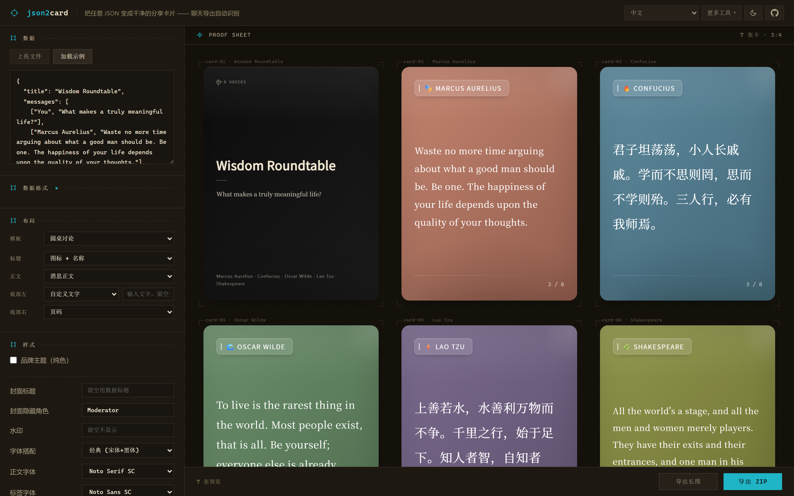
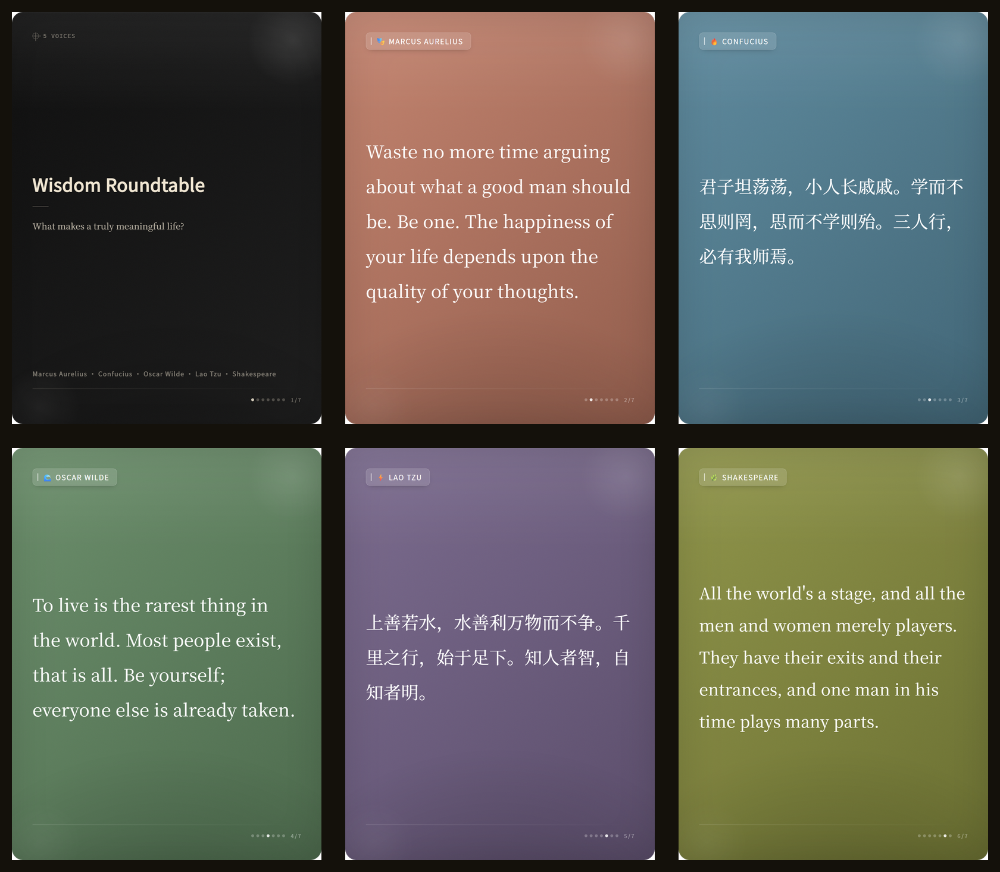

# json2card

> 别再截图聊天记录了——粘贴导出，直接排成能发的卡片图

[⬇ 下载](https://github.com/rockbenben/json2card/releases/latest) · [Docker 自建部署](#开始使用) · [English](README.md)

[](LICENSE) [](https://github.com/rockbenben/365opensource)

不用定义结构，也不用事后在 Figma 里收拾：格式由数据自己说话，品牌色一次设定整套通用。调完导出 PNG，直接放进博客、Notion 或 16:9 幻灯片。

|                  粘进去、调排版                   |                     出来的成品                     |
| :------------------------------------------------: | :-------------------------------------------------: |
|  |  |

## 特性

- **自动识别任意导出** — ChatGPT、Claude、Telegram、Discord、Slack 或你自己的 JSON。多条消息采样验证，一次命中结构；遇到奇怪结构，用一行字段映射指一下即可。
- **导出前先调好样式** — 品牌主题（统一背景 + 文字色贴合博客/幻灯片）、上传自己的字体、6 种可视风格预设、16 色调色板、5 种尺寸、水印 —— 不必事后 P 图。
- **乱输入也优雅降级** — 长消息自动分页，嵌套/非字符串内容强转为文本，` ``` ` 代码块保留等宽，markdown 剥离为纯文字。它会降级，而不是把版面搞崩。
- **自适应字号** — 短语录放大填满画幅，密集/分页内容保持你设定的字号。
- **三种使用方式** — 网页可视化编辑、命令行批处理（不用再写一次性脚本）、REST API 集成。

> [!NOTE]
> 全程在你自己的机器上渲染，聊天记录不出这台机器。跑 Docker 镜像或本地 `npm start`，浏览器打开 `localhost` 即可；没有账号，也没有遥测。

## 开始使用

**Docker**（推荐）—— 一条命令，然后打开 <http://localhost:3000>：

```bash
docker run -d -p 3000:3000 ghcr.io/rockbenben/json2card:latest
```

**Docker Compose**:

```bash
docker compose up -d
```

**从源码运行**:

```bash
npm install && npm run setup-fonts && npm start
# 打开 http://localhost:3000
```

## 支持的格式

| 格式                       | 说明                                    |
| -------------------------- | --------------------------------------- |
| `[["说话人","内容"], ...]` | 简单对话列表                            |
| `{role, content}`          | OpenAI / Claude API（说话人取 `name`，没有就用 `role`） |
| `{from, text}`             | Telegram 导出                           |
| `{author.name, content}`   | Discord 导出                            |
| `{user, text}`             | Slack 导出                              |
| `mapping.*.message...`     | ChatGPT 导出                            |
| 任意结构                   | 自动发现或手动字段映射                  |

每条消息只渲染其**文本**；非文本附件(图片、文件)会跳过，代码块保留等宽，其余 markdown 剥离为纯文字。

对话是最佳场景，但本质是*记录 → 卡片*:把任意对象数组 —— 语录、笔记、FAQ、更新日志 —— 映射到「标签 + 文本」字段，每行就是一张卡(见语录/笔记/新闻模板)。

## 自定义

| 类别         | 选项                                                                                    |
| ------------ | --------------------------------------------------------------------------------------- |
| **模板**     | 圆桌讨论、语录、笔记、新闻 —— 一键为该用途重排布局                                      |
| **风格**     | 6 种预设（经典、柔和、纸质、引用、杂志、典雅）可视画廊 + 7 个可调参数                   |
| **品牌主题** | 整套统一背景色 + 文字色，含一键预设色板                                                 |
| **尺寸**     | 3:4 小红书、1:1 方形(朋友圈/微博)、4:3、9:16 竖屏 Story、**16:9 幻灯片/PPT**(1920×1080) |
| **配色**     | 16 色自动分配，可逐角色自定义                                                           |
| **字体**     | `fonts/` 自动识别，或浏览器上传（data-URI 内嵌；适合拉丁/子集字体）                     |
| **布局**     | 4 个槽位（标题、正文、底部左/右）x 任意字段                                             |
| **水印**     | 自定义文字，底部居中                                                                      |
| **语言**     | 18 种界面语言，含从右到左（阿拉伯语）                                                   |
| **主题**     | 暗色 / 亮色                                                                             |

**16:9 + 品牌主题 = 直接进 PPT** —— 同一段对话,1920×1080 幻灯片就绪：


## API

两个端点，均接受 `POST` 请求，JSON 请求体 `{data, config}`。

| 端点                 | 输出                   |
| -------------------- | ---------------------- |
| `/api/generate`      | ZIP 压缩包（多张 PNG） |
| `/api/generate-long` | 单张拼接长图 PNG       |

```bash
curl -X POST http://localhost:3000/api/generate \
  -H 'Content-Type: application/json' \
  -d '{"data":{"messages":[["You","你好"],["Bot","你好！"]]},"config":{}}' \
  -o cards.zip
```

<details>
<summary>Node.js / Python 调用示例</summary>

**Node.js**:

```javascript
const res = await fetch("http://localhost:3000/api/generate", {
  method: "POST",
  headers: { "Content-Type": "application/json" },
  body: JSON.stringify({
    data: {
      messages: [
        ["You", "你好"],
        ["Bot", "你好！"],
      ],
    },
    config: { cardSize: "1:1", watermark: "我的应用" },
  }),
});
fs.writeFileSync("cards.zip", Buffer.from(await res.arrayBuffer()));
```

**Python**:

```python
import requests
resp = requests.post('http://localhost:3000/api/generate', json={
    'data': {'messages': [['You', '你好'], ['Bot', '你好！']]},
    'config': {'cardSize': '1:1'}
})
open('cards.zip', 'wb').write(resp.content)
```

</details>

## 命令行

```bash
npm run generate                  # test.json -> output/
node generate.mjs data.json      # 自定义输入
node generate.mjs --size 9:16    # 卡片尺寸
node generate.mjs --body-font X  # 自定义字体
```

## 配置参数

全部可选，不传用默认值——特别地：`coverTitle` 缺省时封面取 JSON 自带的 `title`；`cardStyle` 预设垫在你显式传的 `styleParams` 之下。

```json
{
  "config": {
    "cardSize": "3:4",
    "watermark": "品牌名",
    "coverTitle": "封面标题",
    "fontSize": 28,
    "cardStyle": "classic",
    "brandBg": "",
    "brandText": "",
    "styleParams": {
      "textAlign": "left",
      "borderRadius": 40,
      "gradientAngle": 135,
      "noiseOpacity": 5,
      "glowIntensity": 10,
      "lineHeight": 2.0,
      "letterSpacing": 0.5,
      "gradientReverse": false,
      "showQuoteMark": false
    },
    "slots": {
      "badge": "displayLabel",
      "body": "content",
      "footerLeft": "text:品牌名",
      "footerRight": "pageIndicator"
    }
  }
}
```

## 环境变量

| 变量         | 默认值 | 说明                                   |
| ------------ | ------ | -------------------------------------- |
| `PORT`       | `3000` | 服务端口                               |
| `RATE_LIMIT` | `10`   | 每分钟每 IP 最大请求数（`0` 关闭限流） |

## 限制

- 渲染驱动无头 Chromium（Puppeteer）：Docker 镜像已内置；从源码跑的话，首次启动会下载一个浏览器。
- 浏览器上传字体按 data URI 内嵌——适合拉丁或子集字体，上限约 8 MB（完整中文字塞不下，装到 `fonts/` 目录里即可）。
- API 默认每 IP 每分钟 10 次限流（`RATE_LIMIT=0` 关闭）——对外公开实例前记得设。

## 项目结构

```text
generate.mjs        — 渲染引擎
server.mjs          — Express API + CORS
fonts.mjs           — 字体扫描
template.html       — 卡片模板
public/             — 网页界面 + 国际化
Dockerfile          — 一键部署
docker-compose.yml  — Compose 部署
```

```bash
npm test
```

## 关于 365 开源计划

[365 开源计划](https://github.com/rockbenben/365opensource) 的第 **#003** 个项目——一个人 + AI，一年 300+ 个开源项目。

[提交你的需求 →](https://365.aishort.top/) · [Discord](https://discord.gg/PZTQfJ4GjX) · [Telegram](https://t.me/aishort_top)
